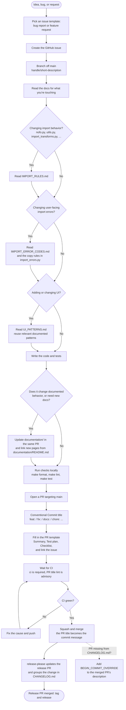

# Contribution workflow

How a change gets from an idea to `main` and into `CHANGELOG.md`, for people
and AI agents alike. The diagram shows the order and the decision points; the
table under it links to the document that explains each step in detail.

This page is the overview. The rules themselves live in
[`DEPLOYMENT.md`](../DEPLOYMENT.md) (contribution workflow, branch protection,
releases, hotfixes) and [`AGENTS.md`](../AGENTS.md) (agent-specific rules).
If this page and those documents disagree, they win: fix this page.

## The workflow

## What to read at each step

| Step | Read this |
| --- | --- |
| Create the issue | [Bug report](../.github/ISSUE_TEMPLATE/bug_report.md) and [feature request](../.github/ISSUE_TEMPLATE/feature_request.md) templates (GitHub offers them when you click **New issue**) |
| Branch off `main` | [`DEPLOYMENT.md` § 1. Create a feature branch](../DEPLOYMENT.md#1-create-a-feature-branch) and [§ Branch Protection Rules](../DEPLOYMENT.md#branch-protection-rules) |
| Changing import behavior | [`IMPORT_RULES.md`](IMPORT_RULES.md) and [`DEPLOYMENT.md` § Updating Import Rules](../DEPLOYMENT.md#updating-import-rules) |
| Changing user-facing import errors | [`IMPORT_ERROR_CODES.md`](IMPORT_ERROR_CODES.md), and the "Copy rules" at the top of [`nofos/bloom_nofos/import_errors.py`](../nofos/bloom_nofos/import_errors.py) |
| Adding or changing UI | [`UI_PATTERNS.md`](UI_PATTERNS.md): check this growing catalog for a relevant pattern and reuse its shared component. It is not a complete inventory of the site's UI; extend it when introducing another verified pattern. |
| Updating docs | [`documentation/README.md`](README.md): docs go in `documentation/`, never a top-level `docs/`; ADRs go in [`adr/`](adr/README.md); PR screenshots go in `review-evidence/` |
| Run checks locally | [`DEPLOYMENT.md` § Before You Push](../DEPLOYMENT.md#before-you-push) |
| Open the PR | [`DEPLOYMENT.md` § 2. Open a pull request](../DEPLOYMENT.md#2-open-a-pull-request), [Conventional Commits](https://www.conventionalcommits.org/), and the [PR template](../.github/pull_request_template.md) |
| Wait for CI | [`DEPLOYMENT.md` § 3. CI must pass](../DEPLOYMENT.md#3-ci-must-pass) |
| Merge | [`DEPLOYMENT.md` § 4. Merge](../DEPLOYMENT.md#4-merge) |
| Changelog and releases | [`DEPLOYMENT.md` § Releases](../DEPLOYMENT.md#releases) and [`release-please-config.json`](../release-please-config.json) (which title prefixes go in which changelog section) |
| Urgent production fix | [`DEPLOYMENT.md` § Hotfixes](../DEPLOYMENT.md#hotfixes) |

## Always squash and merge

Merge every PR with **Squash and merge**.

release-please builds `CHANGELOG.md` from the commit messages that land on
`main`, not from PR titles. A squash merge makes the PR title the commit
message, so a Conventional Commit title (`fix: ...`) is all it takes for the
change to land in the right changelog section. A rebase merge lands each
commit as it is: if any of them isn't Conventional-Commit formatted, the PR can
go missing from the changelog even though its title passed the lint check.

The repository still allows rebase merges, so this is a convention, not
something GitHub enforces. If a PR does go missing from the changelog, fix it
after the fact with a `BEGIN_COMMIT_OVERRIDE` block, as described in
[`DEPLOYMENT.md` § 2](../DEPLOYMENT.md#2-open-a-pull-request).

## People and agents

The workflow is the same for everyone: issue, branch, PR, checks, squash
merge. The differences:

**AI agents**

- Read [`AGENTS.md`](../AGENTS.md) first (Claude Code loads it through
  [`CLAUDE.md`](../CLAUDE.md)), then this page.
- Never push to `main` or force-push a shared branch. Work on a branch and
  open a PR.
- Don't merge a PR unless a person has told you to.
- Never put credentials, tokens, or authentication-cookie values in code,
  logs, screenshots, issues, or PRs.
- When a check fails, find and fix the cause. Don't skip or disable the
  test.

**People**

- One-time setup: `poetry run pre-commit install` and a `.env` file. See the
  [README](../README.md#getting-started).
- There are no required reviewers, so you can merge your own PR once CI is
  green. Ask for a review anyway when a change is risky or affects users.
- For an urgent production fix, use the hotfix title convention
  (`fix: [Hotfix] ...`) in [`DEPLOYMENT.md` § Hotfixes](../DEPLOYMENT.md#hotfixes).
  CI must still pass.

## Known gaps

- **UI guidance has partial coverage.** [`UI_PATTERNS.md`](UI_PATTERNS.md)
  documents selected patterns, including file-upload errors, loading progress
  modals, and import recovery controls. It is a starting point for people and
  agents, not a complete design system. Import-specific messages also have
  [`IMPORT_ERROR_CODES.md`](IMPORT_ERROR_CODES.md) and the copy rules in
  `import_errors.py`; other use cases can be added as they are reviewed.
- **Squash merge isn't enforced.** Turning off rebase merging in the
  repository settings would make the rule above automatic. That needs a
  repository admin.
