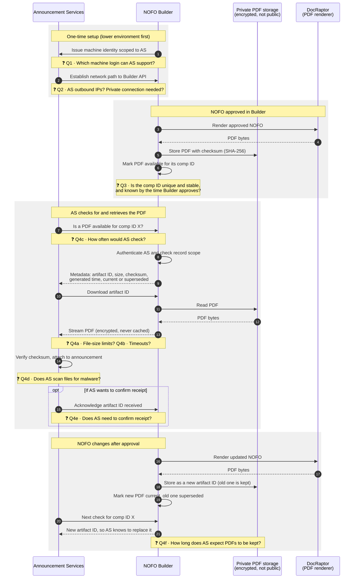

# Approved NOFO PDF retrieval: proposal for Announcement Services

**Status:** Draft for discussion. This is not an approved contract.
**Tracks:** Epic #951, pilot #962, contract spike #957

## Purpose

NOFO Builder will let authorized external systems retrieve approved NOFO
PDFs directly. GrantSolutions Announcement Services (AS) is the first
pilot consumer. This document describes the direction we propose and marks
the points where we need input from AS before we can finish the contract.

Questions are marked ❓ and labeled **Q1–Q4f** in the diagram, and listed in
[Questions for Announcement Services](#questions-for-announcement-services).

## What we propose

- **AS pulls PDFs from Builder.** AS asks Builder whether an approved PDF
  exists for a comp ID, then downloads it from Builder. AS never connects to
  DocRaptor (our PDF renderer) or to our file storage.
- **Each PDF is fixed once created.** If a NOFO changes after approval,
  Builder creates a new PDF with a new artifact ID, checksum and generation
  time. The previous PDF stays available until the replacement is stored.
- **AS gets its own machine identity.** Access is limited to the records
  and OpDivs AS is approved for. Every attempt is logged. A request outside
  that scope reveals nothing, including whether the record exists.
- **Approval status and PDF availability are separate.** A NOFO can be
  approved before its PDF is ready. AS only sees a PDF once it is stored
  and marked available.
- **The contract is not AS-specific.** NIH eRA FOAM is being assessed as a
  second consumer, so field names stay generic. For example, the comp ID is
  sent as a "source record ID".

## Proposed flow

## Questions for Announcement Services

Please add answers in the right-hand column, or reply on issue #962.

| # | Step | Question | Why we're asking | AS answer |
|---|------|----------|------------------|-----------|
| Q1 | Setup | Which machine login can AS support: OAuth 2.0 client credentials, mutual TLS (mTLS), signed JWT, or API key plus IP allowlist? | AS needs its own credential that can be rotated and revoked without affecting other consumers. We won't use a shared static token. | |
| Q2 | Setup | What outbound IP addresses will AS call from? Does AS need a private connection (VPN or private link) rather than HTTPS over the internet? | Decides network rules and any allowlisting in the lower environment and in production. | |
| Q3 | Approval | Is the comp ID unique and stable for the life of an announcement? Is it assigned before the NOFO is approved in Builder? | The comp ID is the key AS uses to look up a PDF. If it's missing at approval or can change, we need a different link between the two systems. | |
| Q4a | Download | What is the largest PDF AS can accept? | Most NOFO PDFs are well under typical limits, but long NOFOs with images can be large. | |
| Q4b | Download | What request and download timeouts does AS use? | Decides whether we stream the PDF directly or offer a short-lived download link. | |
| Q4c | Check | How often would AS check for a new or updated PDF? Would a notification from Builder be preferred? | Sets rate limits and whether polling alone is enough. | |
| Q4d | Attach | Does AS scan received files for malware? | Decides whether Builder also needs to scan, or whether one side is enough. | |
| Q4e | Receipt | Does AS need to confirm it received a PDF? | Tells us whether to build a receipt acknowledgment and record it in the audit log. | |
| Q4f | Retention | How long should approved and superseded PDFs stay available to AS? | Feeds retention rules, which records owners must approve. | |

## Also needed to start

These aren't technical questions, but they take the longest to arrange:

- A technical contact and a security contact (ISSO) on each side.
- Whatever interconnection agreement (ISA or MOU) the two systems require.
- Agreement that early testing uses a lower environment and synthetic NOFOs
  only. No credentials are issued and no real PDFs are shared until security
  and records owners approve the contract (#957).

## Current status

| Work | Issue | Status |
|------|-------|--------|
| Define the contract and lifecycle | #957 | Not started. This document feeds it. |
| Make PDF generation reusable outside the browser download | #958 | Done |
| Store approved PDFs and track availability | #959 | Not started |
| Machine identity and retrieval endpoints | #960 | Not started |
| Replacement, expiration and audit | #961 | Not started |
| AS pilot and eRA FOAM assessment | #962 | Not started. Waits on the above. |

## Not in scope

- Sending Word documents into Builder (tracked separately)
- Publishing to Grants.gov or Simpler.Grants.gov
- Any public access to pre-decisional PDFs
