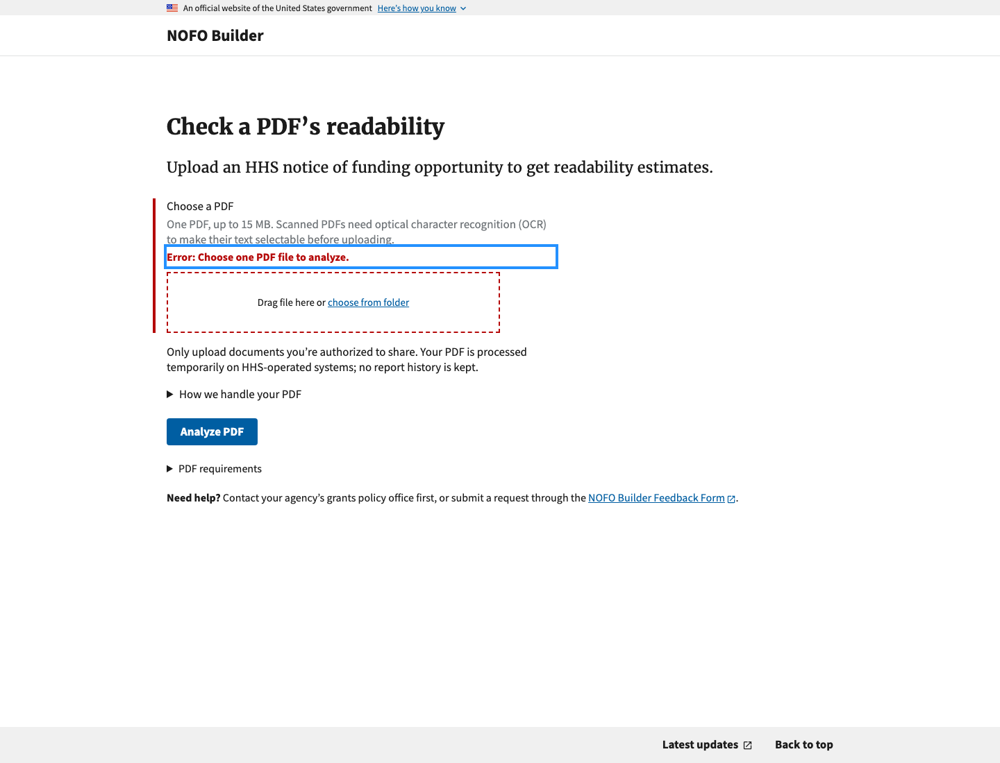

# UI patterns

Use this guide when adding or changing Builder screens. Start with an existing
component and its behavior before creating a new variation. This is a small,
incremental catalog of verified patterns, not an audit of every screen.

## File-upload errors

Use the shared [`file_input.html`](../nofos/bloom_nofos/templates/includes/file_input.html)
component for a file field's error state. NOFO Compare and the PDF checker are
examples of this pattern.

### What the user sees

- The label and file requirements remain visible.
- The field group has a red left border.
- A bold red `Error: …` message appears between the hint and file picker.
- The file picker has a red dashed border and remains available for correction.
- The submit action remains available so the user can choose another file and retry.

The screenshot below shows the PDF checker's missing-file state. Its blue outline
is keyboard focus on the error message, rather than part of the red error styling.



### Implementation

Pass the user-facing error to the shared include instead of recreating its markup:

```django

```

The component adds `usa-form-group--error`, the inline `usa-error-message`,
`aria-invalid="true"`, and an `aria-describedby` reference to the hint and error.
Use a stable, unique field ID. Preserve these associations when customizing a form.

For this server-rendered pattern, do not pass `required=True` if it would make
browser constraint validation intercept an empty submission with a native tooltip.
The server must still validate missing files, file counts, formats, and size;
removing the browser constraint does not make the upload optional.

For the PDF checker, JavaScript focuses the inline error using a temporary
`tabindex="-1"`. Missing-file submissions reach server validation without opening
the processing modal or disabling the submit button. Keep the same error usable
when JavaScript is unavailable.

Write an error that explains the problem and the next action, such as
“Choose one PDF file to analyze.” Avoid raw exceptions or technical diagnostics.
For a single file field, avoid repeating the same message in a separate alert.
A multi-field form may need an error summary linking to its invalid fields; that
pattern is outside this guide's current scope. Operational failures unrelated to
file correction may also need different feedback.

### Verify before shipping

1. Submit without a file: verify the inline error, invalid field association,
   and absence of a competing browser tooltip.
2. Upload a rejected file: verify a useful correction message and no normal result.
3. Use keyboard navigation: verify error focus and that the picker and submit
   action remain usable for retry.
4. Correct the file and resubmit: verify successful processing and cleared errors.
5. Check narrow screens and server validation with JavaScript unavailable.

Useful references:

- [PDF upload page](../nofos/bloom_nofos/templates/pdf_readability.html)
- [PDF interaction behavior](../nofos/bloom_nofos/static/js/pdf_readability.js)
- [PDF page tests](../nofos/bloom_nofos/tests_bloom_nofos/test_pdf_readability.py)
- [Import error codes](IMPORT_ERROR_CODES.md), for blocking NOFO import messages

## Loading progress modals

Use the running-horse progress modal when an action blocks the user for several
seconds, such as Word export or PDF analysis. The Download Word modal in
[`docx_download_button_form.html`](../nofos/bloom_nofos/templates/includes/docx_download_button_form.html)
is the reference implementation; the PDF checker's analysis modal follows it.

For inline progress below an import or upload form, use
[`loading_horse.html`](../nofos/bloom_nofos/templates/includes/loading_horse.html)
instead.

### What the user sees

- A USWDS modal with no close button, a heading such as “Generating Word document…”,
  and a sentence explaining roughly how long it takes.
- The horse runs from the left edge of the track to the right, looping until
  the work finishes, with “Working…” centered below it.
- On success, the modal says the result is ready and closes itself after
  3 seconds. On failure, it shows an error and an OK button.

### Implementation

Include the shared styles and use the track and horse classes:

```django

<div class="margin-top-2">
  <div class="docx-horse-track" id="my-progress-horse" aria-hidden="true">
    
  </div>
  <p class="margin-top-1 text-center" aria-hidden="true">Working…</p>
</div>
```

Don't render the track with `is-running` already set. Add `is-running` from
JavaScript at the moment the modal opens, so the horse starts from the left edge
every time, and remove it when the work ends or the page is restored with the
Back button (`pageshow` with `event.persisted`). If the result appears in
the same page, set `is-finished` so the horse glides to the right edge instead
of jumping. If `is-running` is in the markup, the animation starts on page
load and the horse appears mid-track when the modal opens.

The horse is decorative: keep `aria-hidden="true"` on the track and `alt=""`
on the image, and announce progress through a `role="status"` or `aria-live`
region instead.

### Verify before shipping

1. Trigger the action: verify the modal opens and the horse starts at the left edge.
2. Trigger it again after waiting on the page: verify the horse still starts at the left.
3. Let it finish: verify the success state and auto-close, or the error state and OK button.
4. Go Back after a full-page submit: verify the modal is closed and the button is enabled.
5. Check that a screen reader announces progress and not the image.

Useful references:

- [Word export modal](../nofos/bloom_nofos/templates/includes/docx_download_button_form.html)
  and [its behavior](../nofos/bloom_nofos/static/js/nofo_export_button.js)
- [Shared progress styles](../nofos/bloom_nofos/templates/includes/document_progress_styles.html)
- [PDF analysis modal](../nofos/bloom_nofos/templates/pdf_readability.html)

## Import recovery: buttons and strong navigation links

For import recovery, choose the control based on what activating it does. An
operation can run on the server or in JavaScript; JavaScript alone does not
make something a button action.

| User intent | Behavior | Control |
| --- | --- | --- |
| Import the selected file | Submits the upload form and starts processing | Submit button, styled with `usa-button` |
| Try the import again after an error | Opens the upload form so the user can select a corrected file | Navigation link, styled with `usa-link text-bold` |

### Implementation

Use a native submit button for starting the import:

```html
<button type="submit" class="usa-button">Import</button>
```

Use an anchor with a real destination for returning to the upload form:

```django
<a class="usa-link text-bold" href="{{ retry_url }}">{{ retry_label }}</a>
```

Keep the link label specific to its destination. "Try the import again" opens the
form; it does not resubmit the previous file. Preserve any destination-specific
label, such as "Change this NOFO’s status" when that is the required next step.
Do not use browser-history navigation: the relevant form should remain reachable
when the error page was opened in a new tab or after other navigation.

The reference is [`import_error.html`](../nofos/bloom_nofos/templates/import_error.html).
Its recovery steps begin with an H2. The retry link precedes a separated support
section rendered by
[`import_error_support.html`](../nofos/bloom_nofos/templates/includes/import_error_support.html),
with an H2, contact instructions, and the error code. This support layout is scoped
to import errors; see [Import error page layout](IMPORT_ERROR_CODES.md#import-error-page-layout).
The PDF checker's "Analyze another PDF" link is an existing example of the same
strong navigation-link styling.

### Verify before shipping

1. Follow the retry link: verify it opens the relevant form without starting an import.
2. Use keyboard navigation: verify visible focus and that Enter follows the link.
3. Submit a corrected file: verify the form's submit button starts processing.

This guidance covers this recovery workflow. It does not call for a site-wide
button audit or changes to existing download, export, or other controls. Extend
the catalog as those use cases are reviewed.

## Readability estimate reliability alerts

The PDF readability report uses a USWDS alert to explain confidence in the
estimates derived from extracted text. Reliability describes confidence in
those estimates, not how readable the document is. High reliability does not
guarantee accuracy or establish compliance, accessibility, or clearance.

| Report reliability | Alert variant | Purpose |
| --- | --- | --- |
| High | `usa-alert--info` (blue) | Informational context for interpreting estimates |
| Moderate | `usa-alert--info` (blue) | Informational context for interpreting estimates |
| Low | `usa-alert--warning` (yellow) | Caution about estimates that need careful interpretation |

The supported levels are high, moderate, and low; there is no “extremely low”
level. Missing or unrecognized levels retain warning styling as a fallback.
The presentation does not change how reliability is calculated.

[USWDS alert guidance](https://designsystem.digital.gov/components/alert/#accessibility-guidance)
defines informational alerts as non-critical status information, warnings as
potentially critical information that might require action, and errors as
failed actions. A low-confidence report still contains results, so its
reliability notice uses a warning rather than a red error alert.

Keep the reliability level in the heading and the explanation in the body so
users can understand the notice without relying on color or the icon. Preserve
the source-PDF review guidance and the existing `role="note"`; changing the
visual variant does not make this notice an urgent announcement.

The verified implementation is
[`pdf_readability.html`](../nofos/bloom_nofos/templates/pdf_readability.html),
with rendered-report coverage in
[`test_pdf_readability.py`](../nofos/bloom_nofos/tests_bloom_nofos/test_pdf_readability.py).
[Before-and-after screenshots](review-evidence/readability-reliability-alert/README.md)
show all three levels. When changing this notice, verify the level, alert
variant, and explanatory text together.

This entry covers the readability reliability notice. Add other verified
alert patterns here as they are reviewed; a site-wide alert audit is not
required to extend this catalog.

## Subsection save conflicts

Use this recovery pattern when saving an out-of-date subsection form would
replace newer saved content. The response stays on the subsection edit page and
returns HTTP 409 with a USWDS warning alert. This is an editing conflict, handled
by the editor's template rather than the import error page or import error-code
catalog.

### What the user sees

Ordinary editing keeps the existing form and **Save subsection** action. If the
same subsection's editable fields changed after the form was opened, show:

> This subsection changed since you opened it.
> Your changes have not been saved. Your work is preserved below. Review it
> against the latest saved version before saving.

Show both the submitted fields and the latest saved fields. Preserve the name,
heading level, callout setting, HTML class/page-break setting, and content.
Read-only content fields can be scrolled, selected, and copied. On narrow screens,
stack the columns and wrap the recovery editor's toolbar. Use `font-heading-lg`
with `text-bold` for the comparison/review headings and `text-bold` on the alert
heading. The editor loads Bootstrap after USWDS; without these explicit
utilities, Bootstrap makes the section headings inherit the body font and
reduces heading weights. Keep the page title bold with its existing
`font-heading-xl` utility. The intended faces are Merriweather for page/section
headings and Source Sans Pro for the alert and body copy.

| Action | Behavior |
| --- | --- |
| **Review and combine changes** — primary submit button | Opens an editor initialized with the latest saved version, with the unsaved version alongside it for reference. Reviewing does not save anything. |
| **Save combined version** — primary submit button in review | Saves the user's reconciled fields, checking again for changes made during review. A new conflict preserves that combined draft and shows the new latest saved version. |
| **Discard my changes and return** — secondary outlined navigation link | Returns to the NOFO edit page without writing. The unsaved draft is abandoned. |

Forms opened before deployment have no edit token. Use the heading **The editor
was updated while this page was open.**, with the same preserved fields and
recovery actions. Do not silently accept those saves.

The draft stays in the recovery response and subsequent review form; it is not a
separately saved draft in the database. Support should tell users to keep the
page open or copy their work before leaving or refreshing. Do not direct them to
refresh as the first recovery step. The warning does not identify another editor
or edit time: the token alone cannot establish that attribution.

### Implementation

Use the existing USWDS alert, grid, and subsection editor components. The signed
version token covers this subsection's five editable fields and its identity;
changes to another subsection or NOFO metadata do not cause a conflict. Compare
with the freshly fetched saved fields and save within a transaction holding the
subsection row lock. A valid token with submitted fields already identical to
the latest saved fields can return normally without a write.

Keep the submitted version unchanged across ordinary validation errors. Only an
explicit review action starts a form with the latest saved fields and a fresh
token. Do not issue a fresh token for the stale draft and let a second Save click
bypass reconciliation. Recheck on the eventual combined save.

### Verify before shipping

1. Save different changes from two tabs or two users: the later stale submission
   must preserve both versions and leave the first save intact.
2. Review: verify the editor starts with the latest saved fields, retains the
   unsaved reference, and performs no write until Save combined version.
3. Save another change during review: verify the combined draft is preserved and
   another conflict is shown. Verify validation errors preserve the edit token
   and unsaved reference.
4. Follow Discard my changes and return: verify navigation without a write.
5. Submit a predeployment form without a token: verify the editor-update heading
   and recovery flow. Check that edits elsewhere in the NOFO save normally.
6. Check narrow screens, keyboard navigation, selectable read-only content, and
   simultaneous saves against a database that supports row locks.

References:

- [Before-and-after screenshots and capture notes](review-evidence/subsection-conflicts-1075/README.md)
- [`subsection_edit.html`](../nofos/nofos/templates/nofos/subsection_edit.html)
  and [read-only comparison fields](../nofos/nofos/templates/nofos/includes/subsection_conflict_values.html)
- [Signed edit and recovery tokens](../nofos/nofos/subsection_conflicts.py),
  [save handler](../nofos/nofos/views.py), and [regression tests](../nofos/nofos/tests_nofos/test_subsection_edit.py)
- [Deployment considerations](../DEPLOYMENT.md#subsection-conflict-protection-rollout)
