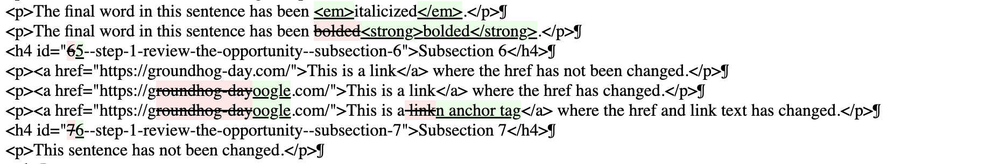

# HTML diffing library

- **Status:** Active
- **Last Modified:** 2025-07-23 <!-- REQUIRED -->
- **Deciders:** Paul Craig <!-- REQUIRED -->

## Context and Problem Statement

The goal of this ADR is to select a library to manage our diffs so that we can compare documents to each other. Previous to this ADR, we were using Python’s [difflib](https://docs.python.org/3/library/difflib.html) which has been okay but very manual.

It’s a little bit complicated because we want to compare different documents against each other, rather than a straight up like-for-like compare, which is typically what these tools do. We also would like the final output to be HTML, which means that it is convenient for us if the comparison format is HTML as well.

### Why can’t our users use the Word comparison tool?

I don’t know all the reasons, but they aren’t using it consistently. We have tested our comparison interface and have received positive feedback about it, so we are building something that (we hope) is simple enough for people to use inside of the NOFO Builder.

## Decision Drivers <!-- RECOMMENDED -->

- Ease of use: how easy to use this diffing tool
- Accuracy: how many changes are accurately represented by the diffing tool
- HTML formatting: Does it handle HTML specifically or no? If no, we have to manage that separately, which is not trivial.

## Options discovered

Usable-looking diffing libraries are not that common. Outside of Python’s standard [‘difflib’](https://docs.python.org/3/library/difflib.html), many of the (Python) diff libraries are either clearly unmaintained or way out of date.

Here is a sample of libraries you can find doing a Google search.

| library                                                                              | last updated |
| ------------------------------------------------------------------------------------ | ------------ |
| [htmldiff](https://github.com/cygri/htmldiff)                                        | 2022         |
| [xmldiff](https://github.com/Shoobx/xmldiff)                                         | 2025         |
| [diff-match-patch](https://github.com/google/diff-match-patch/wiki/Language:-Python) | 2021         |
| [html-diff](https://pypi.org/project/html-diff/)                                     | 2021         |
| [diff2HtmlCompare](https://github.com/wagoodman/diff2HtmlCompare)                    | 2018         |
| [htmldiffer](https://github.com/anastasia/htmldiffer)                                | 2022         |

There are some other pages I found helpful:

- StackOverflow: https://stackoverflow.com/questions/1576459/generate-pretty-diff-html-in-python
- W3C: HTML Diff https://www.w3.org/wiki/HtmlDiff

### Options tested

Ultimately, I tried these 4 options:

1. [htmldiff](https://github.com/cygri/htmldiff)
2. [xmldiff](https://github.com/Shoobx/xmldiff)
3. [diff-match-patch](https://pypi.org/project/diff-match-patch/)
4. [difflib](https://docs.python.org/3/library/difflib.html) (Python standard library)

### Approach

I created 3 sets of HTML files (an `original.html` and a `modified.html`) to compare against.

The idea was to test different “Subsection”-level chunks of content and see how they each were handled by the different libraries. We specifically want to test the HTML output, which only 2 of these tools are specialized at. The other ones are just doing string diffs, so in that case I ended up consuming the HTML using BeautifulSoup and then doing a line-by-line comparison.

## Decision Outcome <!-- REQUIRED -->

The decision outcome is that I am going to try using a modified version of [htmldiff](https://github.com/cygri/htmldiff) .

[htmldiff](https://github.com/cygri/htmldiff) was pretty easy to use, less finicky than [xmldiff](https://github.com/Shoobx/xmldiff), and can natively handle HTML output. The major drawback is that it is a `cli` tool that doesn’t expose a module we can use in our code, but I think we can just take their code and make our own module.

The other drawback that was the same with all of them is that there is no way to natively diff content that moves from one area to another. Any content that is not there is “deleted” and then the diffs generally say that everything has changed for the rest of the file. This means we will have to manage the comparisons ourselves by making sure we are comparing like-for-like subsections and not just iterating through index numbers. This is annoying but it is a legitimately hard problem and it will be the same for any library we end up with.

#### Runners up

- [xmldiff](https://github.com/Shoobx/xmldiff) is would be a possible choice, but if it breaks all the time it would not be, so would need further testing.

- [difflib](https://docs.python.org/3/library/difflib.html) is also viable, but we would need to manage all the HTML stuff ourselves, which we want to avoid if we can help it.

## Libraries tested

### [htmldiff](https://github.com/cygri/htmldiff)

htmldiff is based on [a script by Ian Bicking](https://web.archive.org/web/20040416194325/http://www.webwareforpython.org/~ianb/w4py.org/Wiki/lib/htmldiff.py) which has been updated and refactored into a package. It seems like it’s fast and pretty good, but it does not expose a module-level interface so we need to bring this code manually into our app.

- **Pros**
  - Fast and pretty good
  - Handles non-changes more cleanly than all other libraries
  - Shows changed within tables pretty well
  - It Just Works\* (mostly)
- **Cons**
  - It’s a CLI library that we have to rewrite into a module
  - No obvious answer for changed link text
  - No obvious answer for formatting changes (bold/italics)

| deleted subsection                                                     | diffing a table                                                                      | trouble with formatting                                                                                                                 |
| ---------------------------------------------------------------------- | ------------------------------------------------------------------------------------ | --------------------------------------------------------------------------------------------------------------------------------------- |
| this is pretty good. It shows us the subsection that has been deleted. | this is workable. It mostly keeps the table structure and tells us what has changed. | this is not great. It is telling us that the “italicized” sentence has been added and then below removed. They should be kept together. |
|                                      |                                                    |                                                                                                       |

### [xmldiff](https://github.com/Shoobx/xmldiff)

It’s pretty thorough but breaks if the input HTML is not perfect (eg, will break on ` `, you have to write ` `) so it is probably not right for us. It can do diffs with formatting or link text. However, it often highlights things that have not changed as having been deleted and then re-added. It might be a whitespace thing.

- **Pros**
  - Thorough
  - Can do link text and formatting
  - Actively maintained
- **Cons**
  - Brittle: breaks if the HTML is not perfect
  - Likes to say things have changed that appear to not have changed
  - Confusing/misleading

| diffing a table                                                                  | diffing non-changes                                                                                                                                                                        |
| -------------------------------------------------------------------------------- | ------------------------------------------------------------------------------------------------------------------------------------------------------------------------------------------ |
| very confusing. Hard to identify what the changes to the table are in this diff. | I don’t know specifically what is happening here but the right answer is that these have not changed. It is telling us they were added and removed but all the text is literally the same. |
|                                                 |                                                                                                                                                          |

### [diff-match-patch](https://pypi.org/project/diff-match-patch/)

It’s fast but not clearly better than difflib. It doesn’t understand HTML so you have to process it all first and extract the text content manually.

Weirdnesses: not understanding HTML is a tough one for us.

- **Pros**
  - Fast and definitely does diffs
  - The raw string HTML catches href changes and formatting changes
- **Cons**
  - Not sure if it is better than difflib?
  - HTML has to be managed separately

| regular diff                                                        | diffing changes for formatting and links                                                            |
| ------------------------------------------------------------------- | --------------------------------------------------------------------------------------------------- |
| It’s fine. It is accurate but it is treating the tags like strings. | It’s good about formatting and links but that’s because it is treating things as strings, not HTML. |
|                           |                                                           |

### [difflib](https://docs.python.org/3/library/difflib.html)

From the Python standard library. This is what we are using currently, although we are using it for markdown, not for HTML. It seems to work equivalently to `diff-match-patch`, but wouldn’t need to be downloaded as a package. Not natively understanding HTML is an issue.

- **Pros**
  - Fast and definitely does diffs
  - The raw string HTML catches href changes and formatting changes
- **Cons**
  - HTML has to be managed separately

No screenshots available. It seems equivalent to [`diff-match-patch`](https://pypi.org/project/diff-match-patch/).
