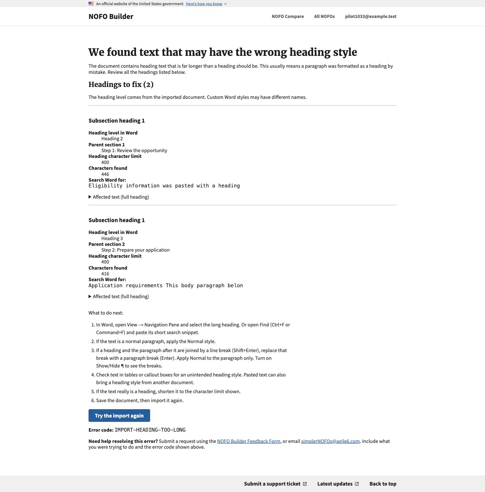
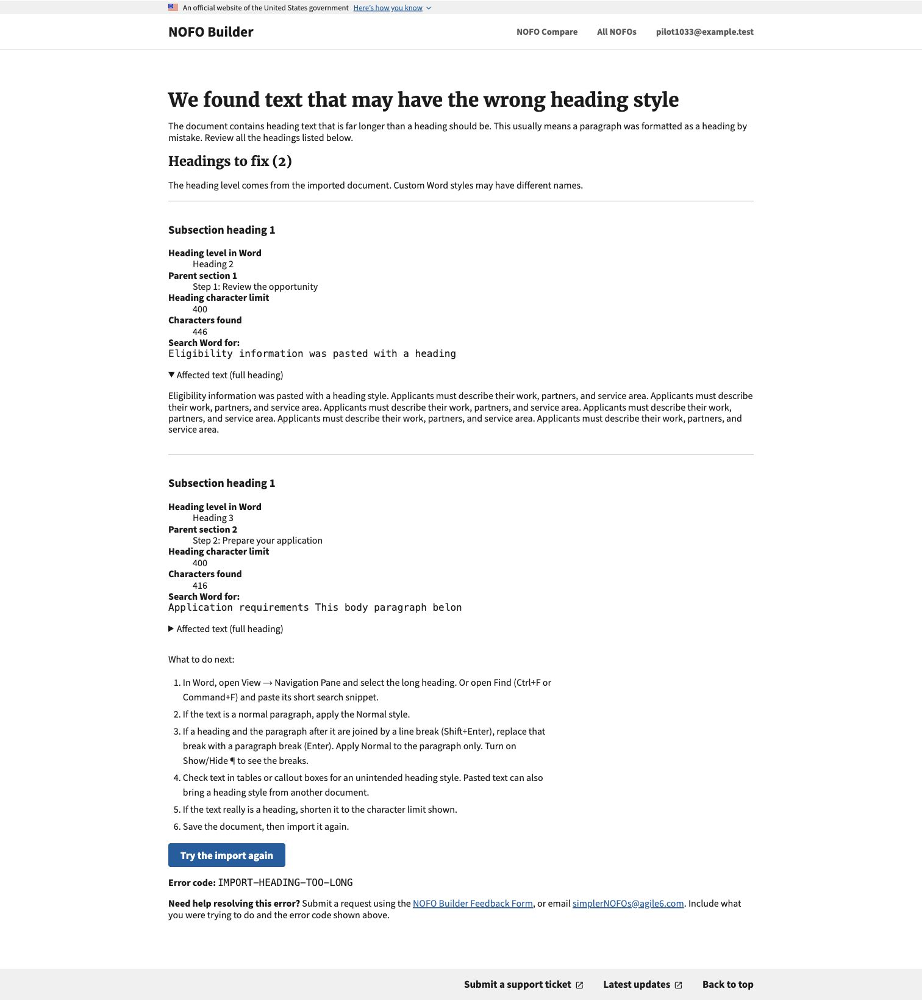
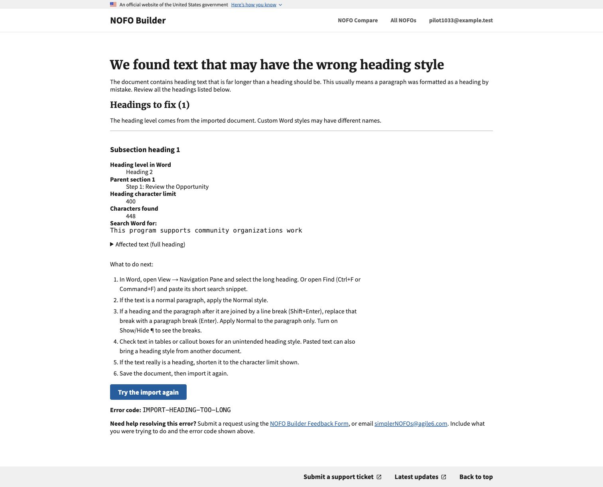
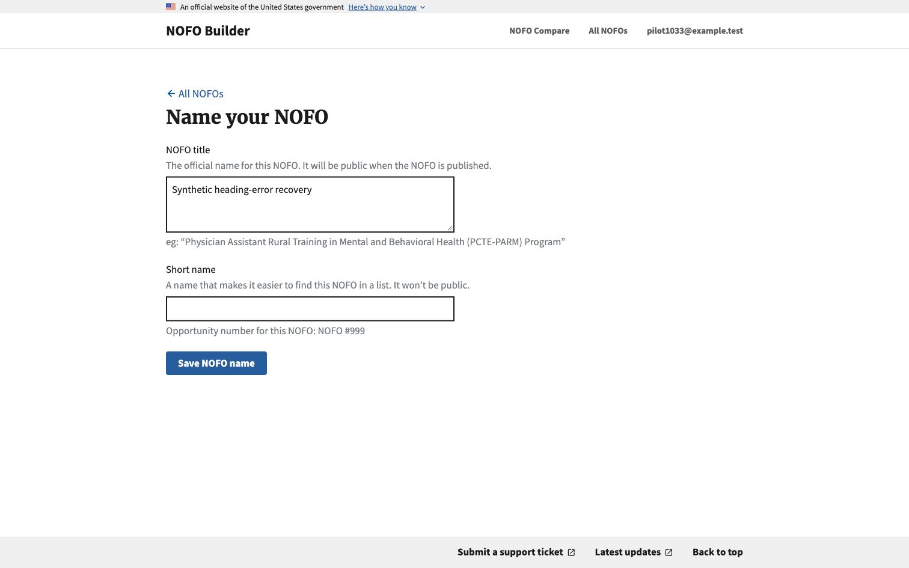
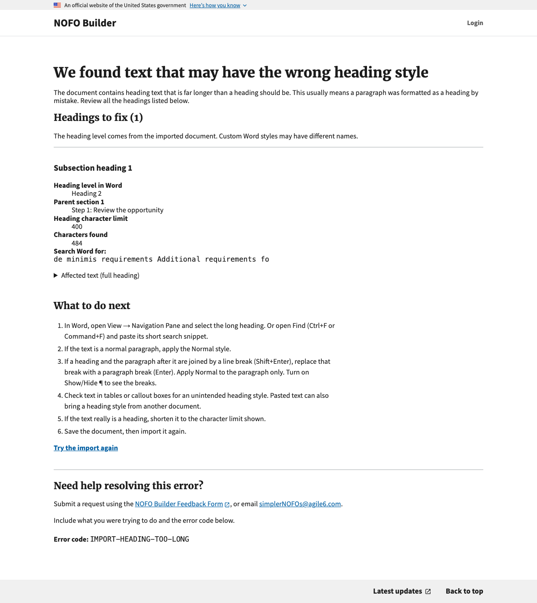
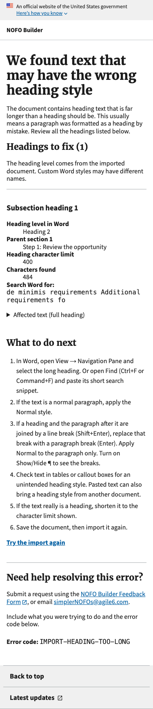

# Long-heading import recovery (#1040)

## Why

One upload should list all overlong headings, so writers do not have to fix and upload the same document repeatedly. The shared import pipeline and error renderer serve Builder, re-import, Compare, and Composer. Existing character limits and transaction rollback behavior are unchanged.

## Browser checks

Chrome, local Docker build, synthetic account and documents only:

- One HTML upload reported two long subsection headings in different sections. Each showed its original heading level, parent section, count, limit, and a search snippet capped at 50 characters.
- A manual line break in a heading produced a space in the search snippet, rather than joining two words. Stored heading names keep their existing normalization.
- Full heading text opened through the native details control.
- The existing `mistagged-paragraph-heading.docx` fixture reported its 448-character Heading 2 under the correct parent section.
- After correcting heading styles in the synthetic HTML document, import reached the normal “Name your NOFO” step.

## Scope and limitations

Heading levels are inferred from source tags, not exact custom Word style names. No copy-button JavaScript or external help article was added. These checks do not establish screen-reader compatibility or test the reported CDC/ACF production documents.

General warning logs include heading kind, source tag, parent section order, character count, and limit. Document excerpts and parent section names deliberately stay out of these logs. Existing import-attempt records carry the filename and OpDiv. This differs from the issue's suggested excerpt logging, and is called out for review.

## Tests

Regression coverage includes batch reporting, source levels before heading demotion, manual breaks, search length, escaping, content-free logging, and the existing failed re-import rollback tests. Final suite results are recorded in the PR.

## Review follow-up: recovery and support layout

- Recovery steps now begin with an H2, "What to do next".
- "Try the import again" is a bold navigation link to the upload form, consistent
  with the PDF checker's "Analyze another PDF" link; it does not retry an upload.
- The import-only support component has an H2, a top divider, and spacing after
  the retry link. Contact instructions and the error code are grouped together.
  General 400/500 pages retain their existing support component.
- "de minimis" emphasis now changes text nodes only, preserving plain search
  snippets and other attributes. Regression coverage includes an actual HTML
  upload, escaped text, repeated matches, and existing nested emphasis.
- Chrome screenshots below render the real Django error template and local
  stylesheet with synthetic heading data. Desktop width: 1200px; mobile: 375px.
  Heading hierarchy, retry destination, support placement, and absence of mobile
  horizontal overflow were checked. This is not a human screen-reader test.

Follow-up validation: full Django suite **2,377 tests, OK (2 skipped)**;
pre-commit checks and diff whitespace checks passed.
