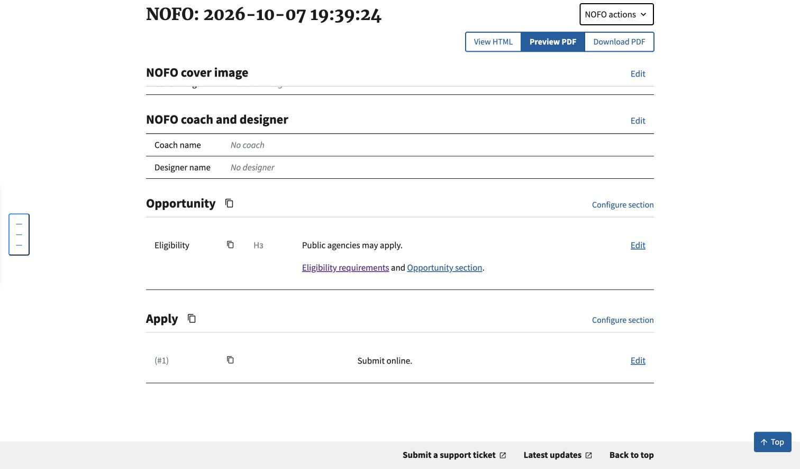

# Wrapped heading import validation

Synthetic HTML imported through the authenticated Builder endpoint into an isolated local SQLite database, then inspected in Chrome on October 7, 2026. No production data, credentials, or PDF vendor calls were used.

The fixture has a div-wrapped `h1` section, a nested div-wrapped `h2` subsection, prose, a link to the subsection heading, and a link to the outer wrapper ID. A second unwrapped section provides a boundary/control.

Verified in the saved edit page:

- Opportunity and Apply are separate sections.
- Eligibility is a structured H3 subsection under Opportunity, matching existing H1/H2 import demotion.
- Public agencies may apply and Submit online remain visible.
- The original heading reference reaches `#1--opportunity--eligibility`.
- The former wrapper reference reaches `#opportunity` rather than a missing target.

This is editor and persistence evidence, not a PDF layout or accessibility conformance check. Existing semantic-role containers, table/list/figure ancestry and unrelated divs are outside the supported normalization shape and remain unchanged.
