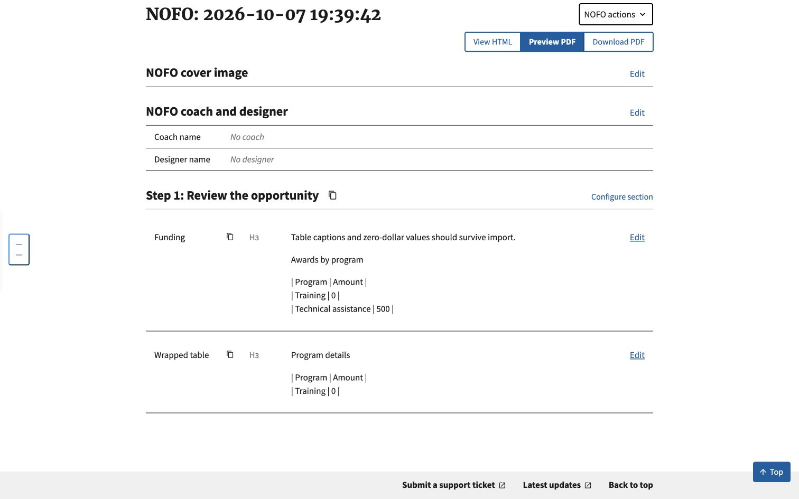
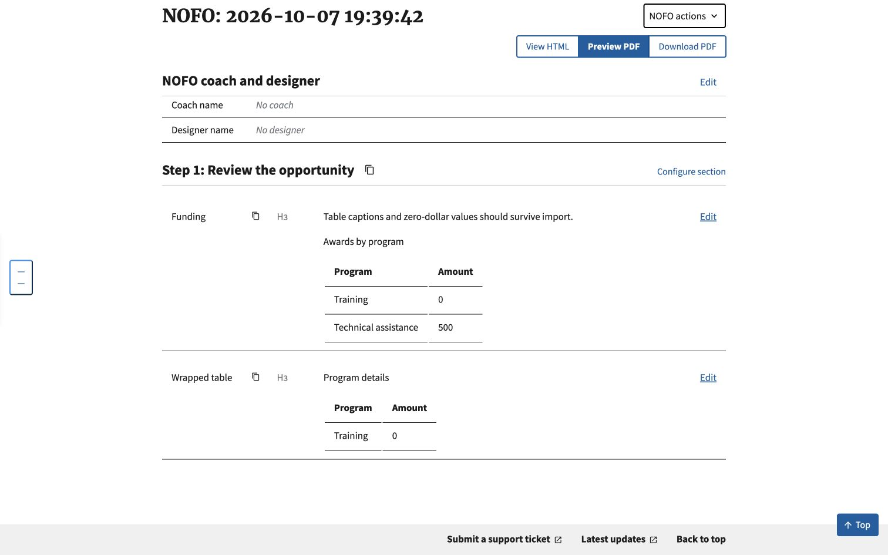

# Captioned table import verification

Fixes #1050. Synthetic content only, tested October 7, 2026.

## Browser evidence

Both records were imported through the real authenticated Builder import
endpoint into an isolated local SQLite database, then inspected in Chrome on
the Builder edit page at `127.0.0.1:8897`. No conversion or persistence was
mocked for the fixed record. The before record used the upstream row converter
in a temporary Python patch during import, recreating the old conversion
behavior without changing application source.

- [Before](before.jpg): direct and figure-wrapped captioned tables become
  pipe-delimited prose because the separator row is absent.
- [After](after.jpg): both become rendered tables; caption text, column values
  and the `0` value remain visible.





The caption remains visible text before the Markdown table, matching the
existing converter's representation. This does not add a semantic HTML
`caption` tag, certify accessibility, or measure PDF layout. Existing saved
bodies are not automatically repaired. No DocRaptor or Word-export API was
called.

The fix covers a caption immediately before the first row. Tables with a
`colgroup` before direct `tr` children have a separate existing row-detection
limitation, with or without a caption; that markup is not repaired here.

## Regression evidence

The focused suite covers direct and figure-wrapped tables with and without
captions; marked headers and unmarked first rows; `thead`/`tbody` shapes;
merged-cell fallback; caption links/emphasis; source-soup restoration on both
success and error; and the unchanged one-cell callout policy.

Run from `nofos/` with the project's Python 3.14 environment:

```sh
DEBUG=False DATABASE_URL=sqlite:////tmp/caption-1050-tests.sqlite3 python manage.py test nofos.tests_nofos.test_import_captioned_tables nofos.tests_nofos.test_import_characterization nofos.tests_nofos.test_import nofos.tests_nofos.test_reimport nofos.tests_nofos.test_import_transforms nofos.tests_nofos.test_before_you_begin_import nofos.tests_nofos.test_nofo_markdown composer.tests.test_views.ComposerImportViewTests compare.test_views.CompareImportViewTests --noinput
```

194 tests pass, with four tracked expected failures from the tests-first
baseline (#1049 wrapped main/subheading, #1051 image, #1052 list-item anchor).
The #1050 caption regression is now a normal passing test. The baseline
characterization branch is a stacked dependency; no parser extraction is in
this change.
