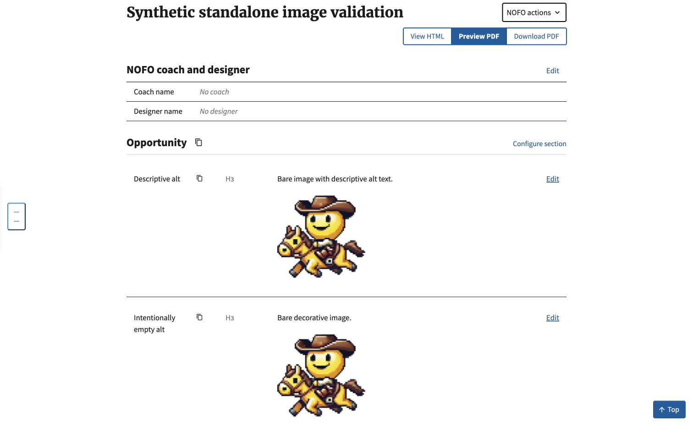
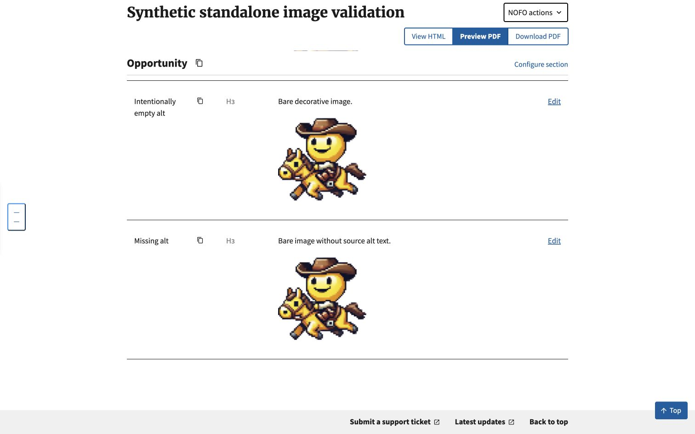

# Standalone image import verification

On October 7, 2026, synthetic HTML was imported through the authenticated Builder endpoint into an isolated SQLite database. Chrome local app port 8899 then displayed all three bare image variants: descriptive alt, intentionally empty alt, and source alt omitted. Screenshots use an existing local favicon asset; no remote image fetch, production data, credentials, or PDF vendor call was needed.

The automated persistence regression covers bare and paragraph-wrapped images for all three alt states, checks the configured `safe_markdown` output, and blocks `requests.get` during import. Existing missing-alt behavior remains: missing alt is backfilled as empty alt and stored as raw HTML, while deliberately empty alt uses Markdown image syntax. The internal missing-alt marker is consumed by the converter, not persisted.

Validation: 804 tests passed across characterization, image regressions, import, normalization and Markdown conversion. Four expected failures remain for separate heading/table/anchor issues. No PDF layout or accessibility-conformance claim is made.
