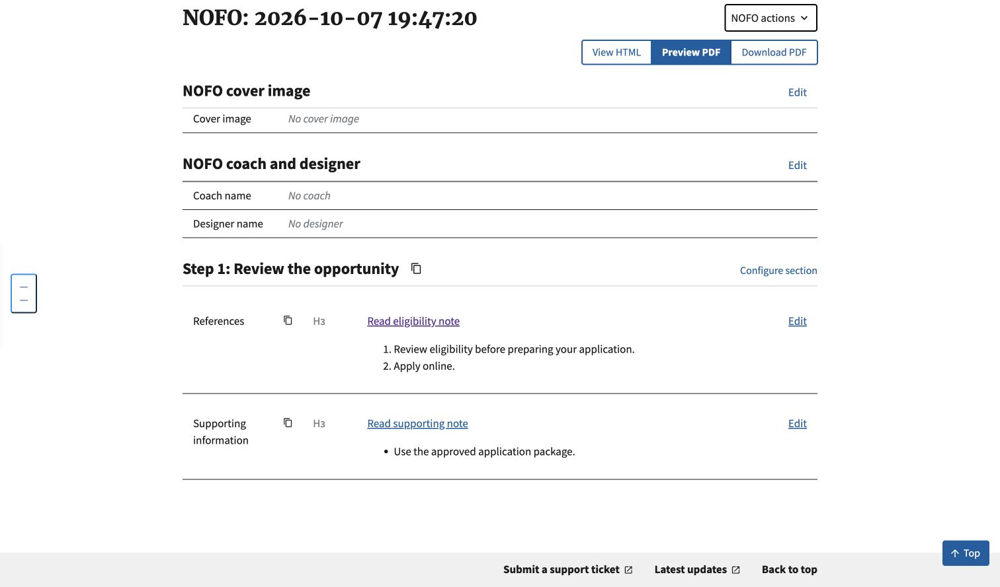

# List-item link targets: #1052

Verified on local Builder at `127.0.0.1:8898`, using a synthetic HTML document and a synthetic local account. The document was submitted through the authenticated Django import endpoint and persisted before browser inspection. No production records or PDF conversion service were used.

The screenshot shows the imported ordered and unordered lists in the editor after clicking **Read eligibility note**. Chrome reached `edit#note-1`. DOM inspection confirmed one `a#note-1` inside the eligibility list item and one `a#support-1` inside the supporting-information list item. Both retain their source fragment names and list numbering.



## Regression checks

Run from `nofos/`, with `DEBUG=False` and an isolated SQLite test database:

```sh
python manage.py test nofos.tests_nofos.test_import_list_anchors nofos.tests_nofos.test_import_characterization nofos.tests_nofos.test_import nofos.tests_nofos.test_reimport nofos.tests_nofos.test_import_transforms nofos.tests_nofos.test_before_you_begin_import nofos.tests_nofos.test_nofo_markdown nofos.test_nofo nofos.test_endnotes nofos.tests_nofos.test_endnote_import composer.tests.test_views.ComposerImportViewTests compare.test_views.CompareImportViewTests --noinput --verbosity 1
```

Result: 878 tests passed, including 4 remaining expected failures from separate tracked import defects. An independent reviewer also ran 164 focused tests, with those same 4 expected failures and no blockers.

Coverage includes ordered, unordered, nested, and non-default-start lists; explicit empty anchors; unused and duplicate IDs; collisions with other elements; native Word endnotes; list targets inside table cells; attribute safety; and authenticated import, persistence, and configured Markdown rendering.

Only referenced, unique, non-native list IDs receive the existing minimal bookmark anchor. Unused IDs, ambiguous duplicate IDs, and native endnote/footnote IDs keep their existing behavior. This does not claim to repair malformed duplicate-ID documents or verify generated PDF links.
