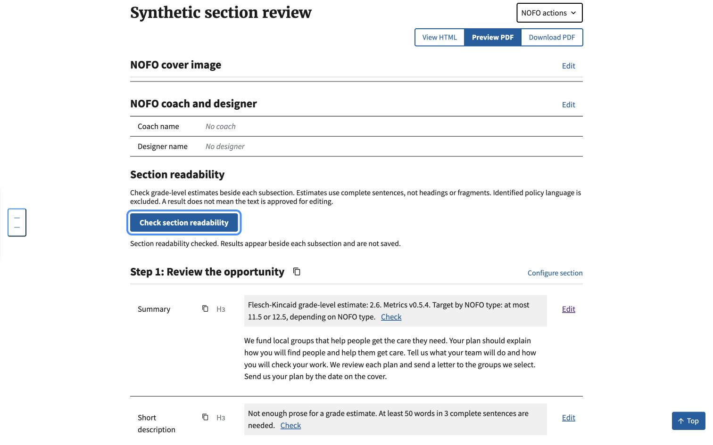
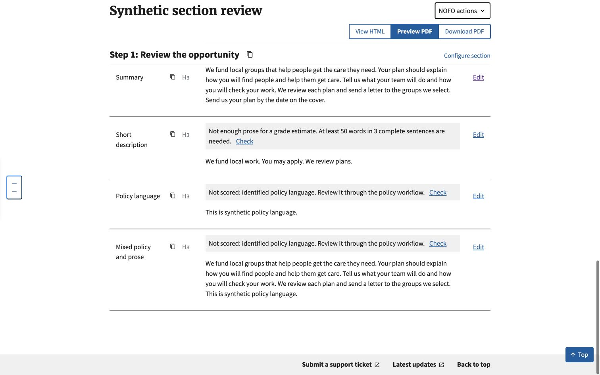
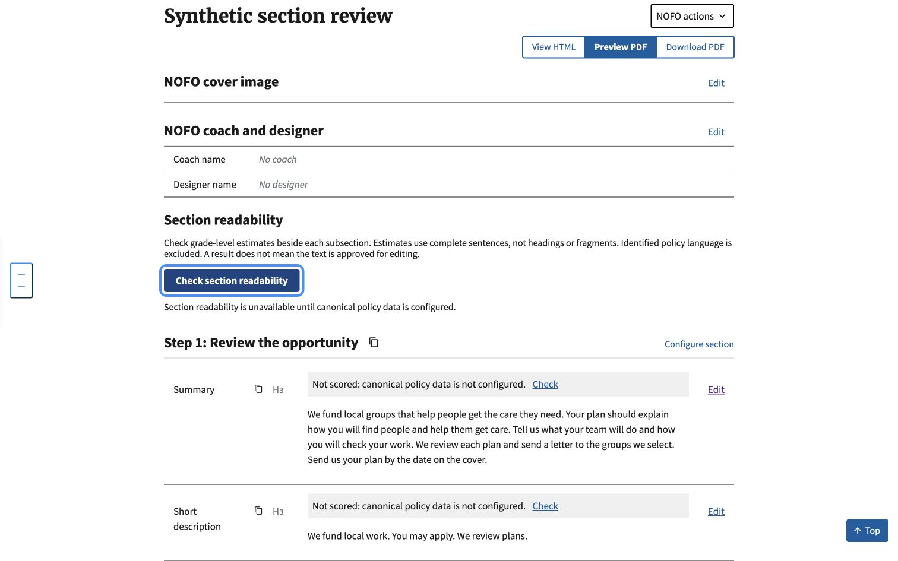

# Section readability verification

Verified locally on October 8, 2026, using a synthetic NOFO in a disposable
SQLite database. No shared environment, real NOFO or production flag was changed.

## Automated checks

- Full Django suite: 2,435 tests passed, with two existing skips.
- JavaScript suite: 63 tests passed, including seven new UI behavior tests.
- Seventeen focused Python tests cover the real metrics engine, policy checks,
  group access, CSRF, freshness, partial failures and default-off behavior.
- Migration check: no changes detected. Formatting and whitespace checks passed.
- Runtime uses Builder's pinned hhs-nofo-metrics 0.5.4, not an upgraded engine.

## Chrome verification

- Check-all displays inline estimates in document order. Individual checks work
  with the keyboard and preserve focus.
- Editing and saving clears prior results. A fresh single-subsection check uses
  the edited content.
- Current policy and a mixed policy/prose subsection are excluded, independent
  of the policy export flag.
- Changing canonical policy data invalidates the open page's results. Reloading
  with no current canonical data prevents scoring and explains why.
- Short prose displays an insufficient-text message instead of a numeric grade.

## Review and remaining limits

Local code review checked reuse, access, stale responses and failure handling.
It tightened focus handling and back-forward cache invalidation. This is not an
independent subagent review or a screen-reader/accessibility certification.

The feature defaults off. Canonical configuration checks do not establish
comprehensive policy coverage. Verify that coverage and complete the real-NOFO
pilot in #1073 before enabling a shared environment. The 50-word/three-sentence
display floor is provisional. Clipboard prompts remain separate work in
#1071/#1072; no rewrite or compliance verdict is included here.
