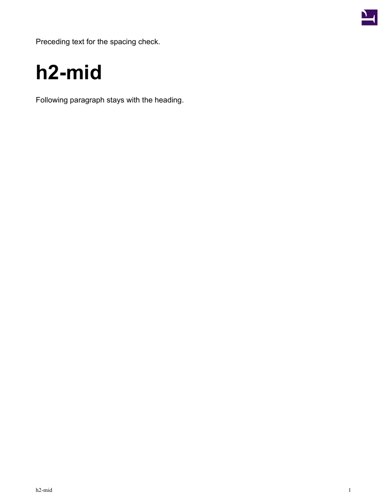
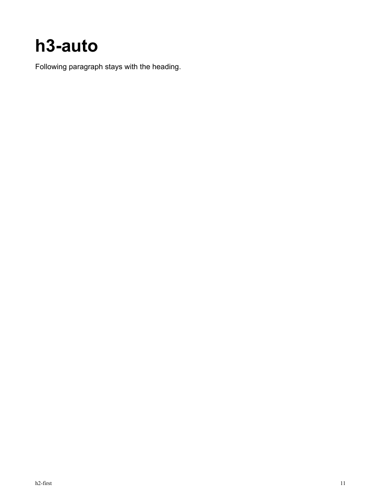

# Main content heading spacing

The main content `h2` and `h3` top margins increase from 20px to 28px
(an extra 6 PDF points). The direct-child selectors leave cover, contents,
callout, and nested headings alone. The existing first-`h3` exception stays
in force. No padding or page-position detection is added.

## Renderer verification

Rendered the synthetic fixture before and after the change with local Prince 17
on October 6, 2026. Measured text positions with pdfplumber and inspected rendered
PNG pages. No production documents, credentials, or remote conversion service
were used. This checks local Prince behavior, not the deployed DocRaptor version
or every agency theme.

The fixture covers each heading level mid-page, after an automatic break, after
a forced heading break, after Builder's explicit break-marker markup, and as the
first heading. Automatic-break fixtures also exercise keeping the heading with
its following paragraph near the bottom of the preceding page.

| Heading | Placement | Before top (pt) | After top (pt) |
| --- | --- | ---: | ---: |
| h2 | Mid-page | 94.74 | 100.74 |
| h2 | Automatic break | 61.74 | 61.74 |
| h2 | Forced heading break | 61.74 | 61.74 |
| h2 | Builder break marker | 61.74 | 61.74 |
| h2 | First heading | 61.74 | 61.74 |
| h3 | Mid-page | 156.96 | 162.96 |
| h3 | Automatic break | 61.11 | 61.11 |
| h3 | Forced heading break | 61.11 | 61.11 |
| h3 | Builder break marker | 61.11 | 61.11 |
| h3 | First heading | 61.11 | 61.11 |

All ten position assertions passed: mid-page headings moved down by 6pt,
page-start heading positions and page numbers stayed unchanged. Prince already
discards these margins at page starts, including the explicit-break cases;
additional CSS overrides are unnecessary. `git diff --check` also passed.

To reproduce from the repository root with Prince installed:

```sh
prince documentation/review-evidence/content-heading-spacing/fixture.html -o /tmp/content-heading-spacing.pdf
```

Compare with the same fixture and the base stylesheet from the parent commit.
The fixture uses Arial for consistent synthetic text metrics; page-start behavior
is provided by the real base stylesheet and Prince's pagination.




