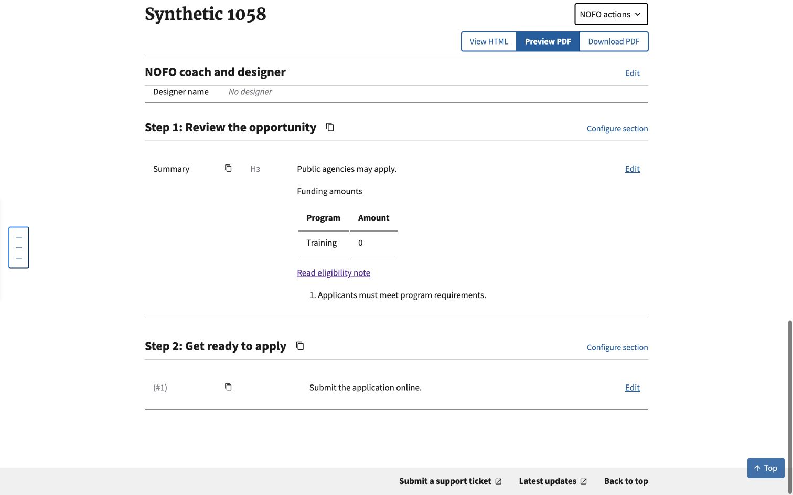

# Document processing smoke check

Local Chrome check of the #1058 refactor, using an isolated SQLite database and
synthetic HTML. No production document or credentials were used. DEBUG was off.

The existing import form accepted the synthetic HTML, advanced to naming, saved
the NOFO and displayed its edit page. Verified both step headings, Summary,
applicant prose, the Funding amounts caption, the table's zero value, and the
ordered-list content. Clicking Read eligibility note reached `#note-1`.

This is a content-processing smoke check, not a new Word conversion test or PDF
export check. Automated import/reimport, Composer and Compare tests cover the
other consumers and the unchanged Word conversion path.
