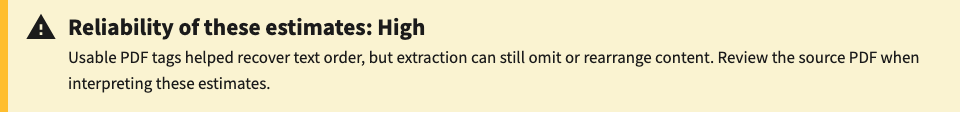
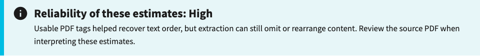
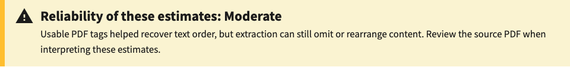
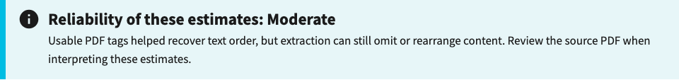
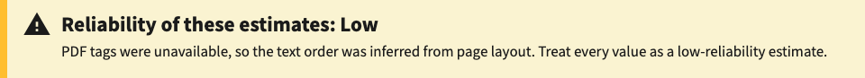

# Reliability alert comparison

Captured October 7, 2026 in headless Chromium at a 1100 × 950 viewport.

These are screenshots of the actual Django report template and repository styles, rendered with the synthetic `REPORT` test fixture. The before template comes from upstream main (`729b85d6`); the after template includes this PR. Each pair uses identical report data. High and moderate use the tagged profile; low uses the generic profile. These fixtures demonstrate presentation, not measurement accuracy. The result-ready modal was dismissed before capture. Screenshots are cropped to the reliability alert.

| Reliability | Before | After |
| --- | --- | --- |
| High |  |  |
| Moderate |  |  |
| Low |  |  |
