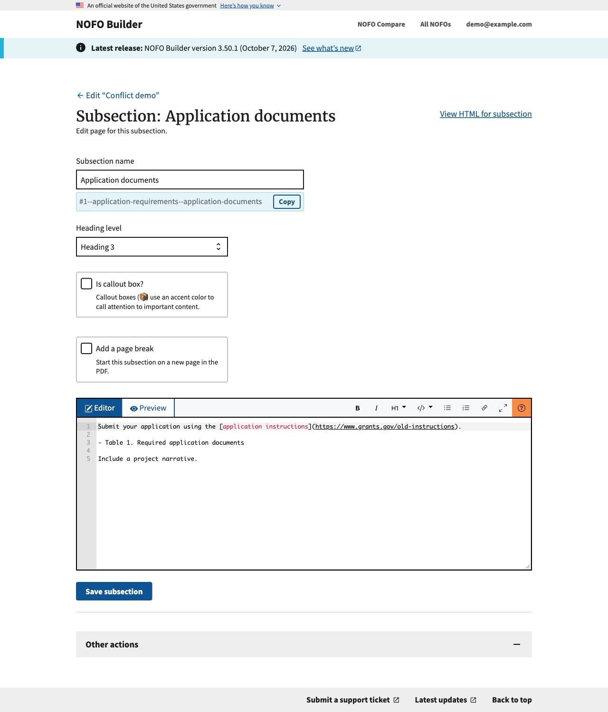
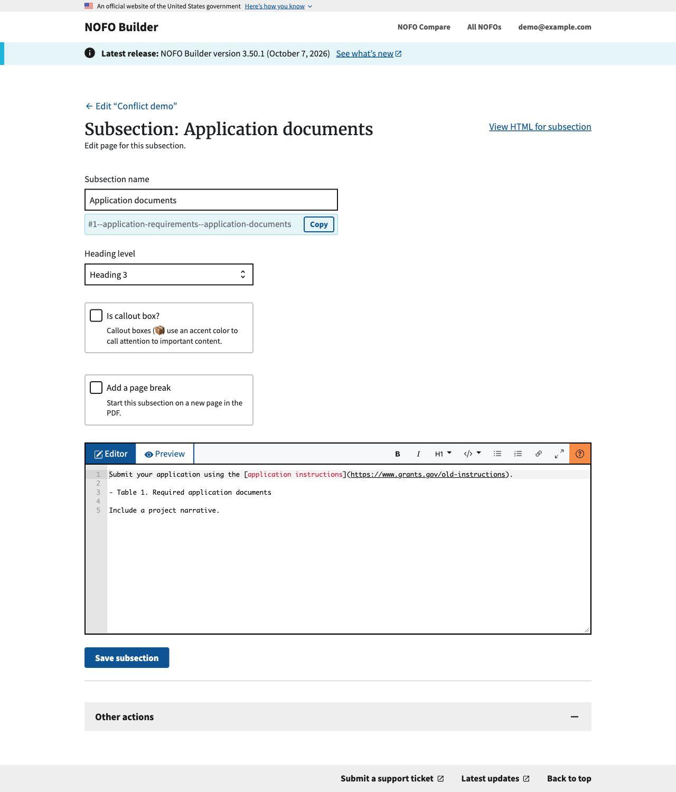
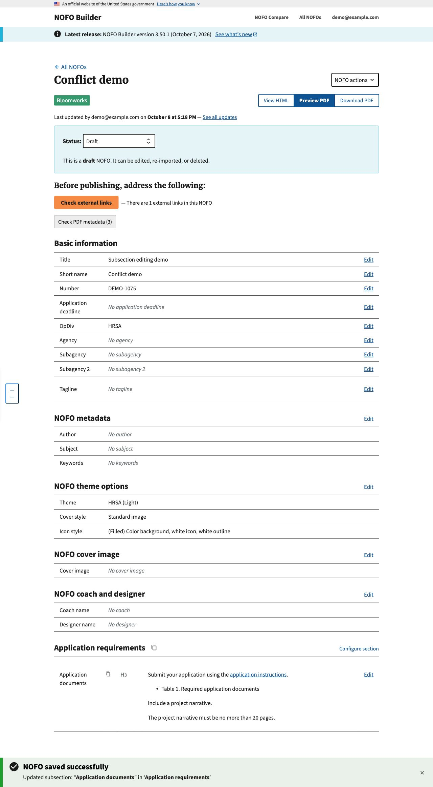
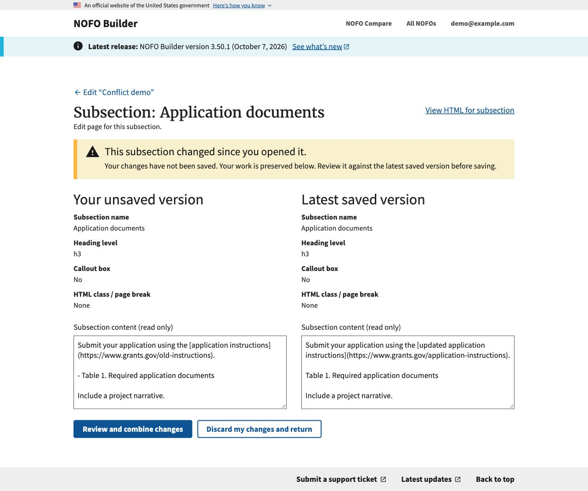
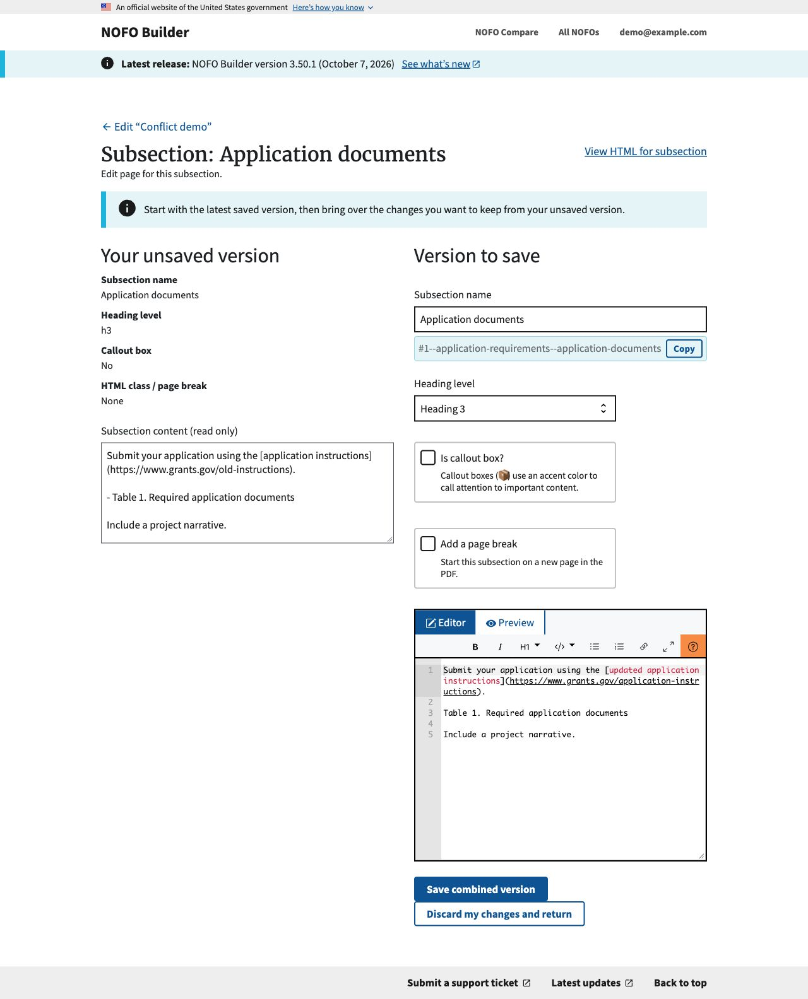
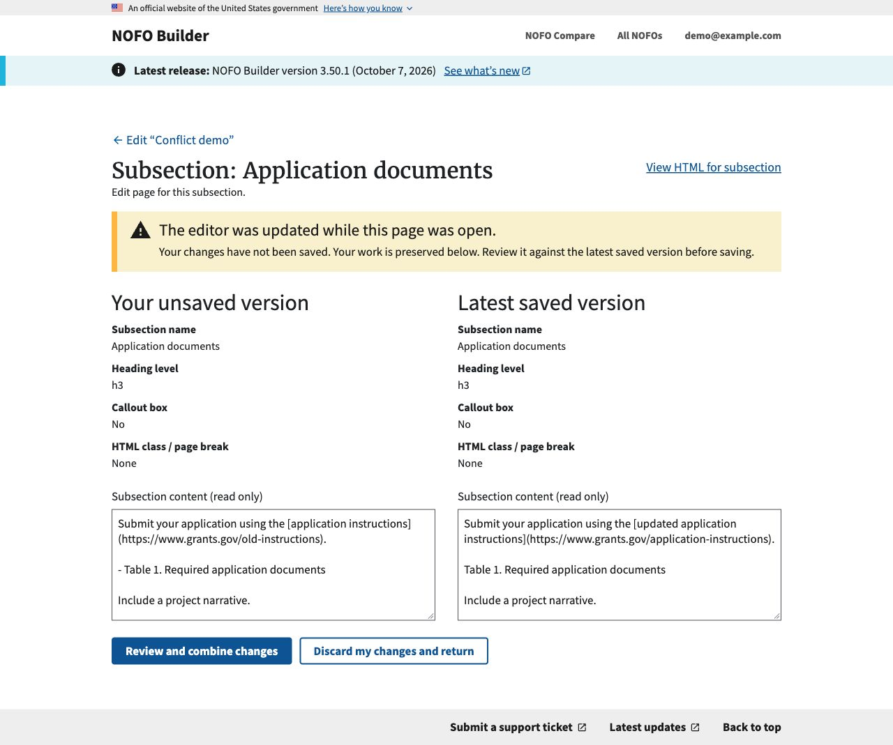
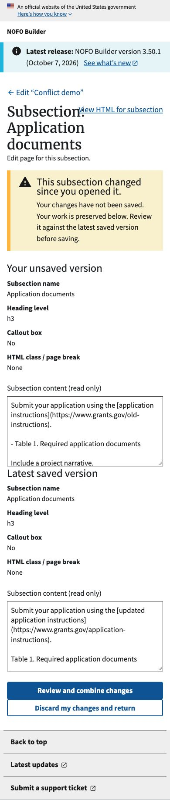
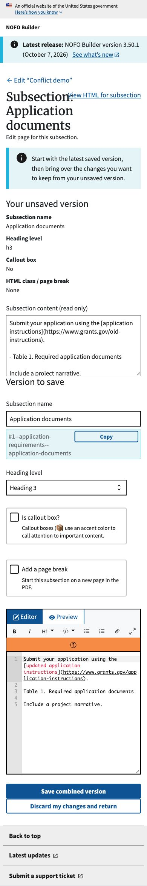

# Subsection save conflicts: before and after

Review evidence for issue #1075 and PR #1076. Captured October 8, 2026,
using fictional NOFO content and a local demo account.

## Normal subsection editing

Opening the subsection editor retains the existing editing layout and Save
subsection action. The version token is hidden; there is no new confirmation
step during ordinary editing.

| Before | After |
| --- | --- |
|  |  |

## Saving a stale tab

The demo opens two forms for the same subsection. Tab A corrects the application
link and removes the bullet from the table caption, then saves. Tab B adds a
20-page narrative limit to its older text, then tries to save.

**Before:** the save succeeds and returns to the main NOFO edit page. The old
link and bulleted caption replace Tab A's corrections, without a warning.
The screenshot is the resulting NOFO page; its layout is not changed by this PR.

**After:** the save is blocked. The subsection page displays the unsaved fields
alongside the latest saved fields, with Review and combine changes as the primary
action and Discard my changes and return as the secondary action. The read-only
content fields can be scrolled and selected to copy longer drafts.

## Reviewing and combining changes

This is a new state; the previous editor had no conflict-recovery screen.
Review opens an editable copy of the latest saved version while keeping the
unsaved version alongside it. No write occurs until Save combined version is
submitted. Discard returns without writing.

## A form opened before deployment

This is also a new state. A submission without the new hidden token displays
“The editor was updated while this page was open” and the same recovery actions.
Its unsaved fields remain available; refreshing is not required to recover them.

## Narrow screens

The comparison and recovery columns stack at 390px. The recovery toolbar wraps
within the editor. These are the new states, so no corresponding old mobile
conflict screen exists.

| Conflict | Review |
| --- | --- |
|  |  |

## Capture and verification

- Desktop viewport: 1280 × 720; mobile viewport: 390 × 844. Images are full-page
  browser captures with the original application styles and initialized editor.
- Before renders use the parent revision's exact subsection template and
  `NofoSubsectionEditView.form_valid` handler, with the same common application
  shell and fixture as the after renders. After renders use commit `fc14e6d2`.
- Captures use rendered Django responses from an authenticated test client,
  served locally with the application's static assets. No production NOFOs,
  user data, credentials, or session-cookie values appear in these images.
- The reproduction asserts that the baseline stale POST redirects and overwrites
  the subsection; the protected stale POST returns HTTP 409 and retains Tab A's
  saved content. Review returns HTTP 200 without saving. A missing-token POST
  returns HTTP 409 with the submitted draft preserved.
