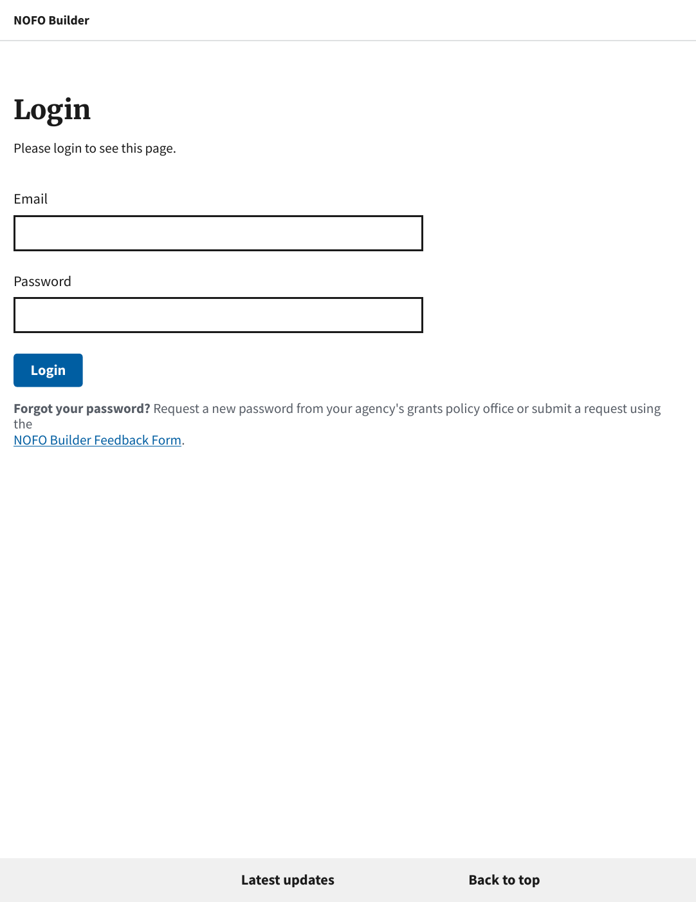
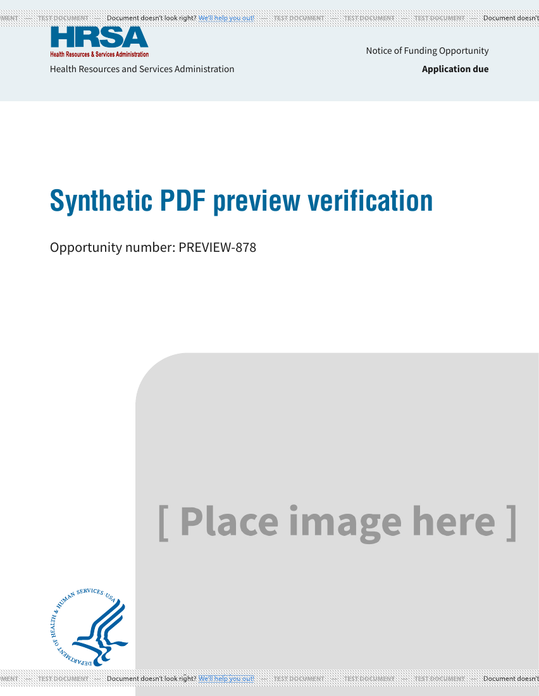

# PDF preview login-page regression (#878)

Verified September 8, 2026, against baseline `2d3b505c` and this fix.

## Reproduction and browser verification

An isolated local Django app and SQLite database contained a synthetic HRSA NOFO
(`PREVIEW-878`). A real Chrome session logged in, opened the editor, and clicked
**Preview PDF**. Only the DocRaptor API boundary was replaced by a local renderer:
for `document_url` it made a fresh anonymous browser request; for
`document_content` it rendered the supplied HTML at the supplied base URL.

- **Before:** the anonymous fetch redirected to login; the print POST returned
  HTTP 200 / `application/pdf` containing “Login — NOFO Builder.”
- **After:** the same interaction returned the synthetic NOFO, with inline PDF
  disposition. Download PDF also completed with the expected filename.
- A separate anonymous HTML request still redirected to login after the fix.

The separate middleware regression tests cover HTTPS requests with missing,
unlisted, chained, and exact allowlisted forwarded IPs. These establish a mechanism
consistent with Ben's report, not the exact cause of his production request.

## Real PDF engine verification

The captured fixed synthetic HTML was also submitted to the real DocRaptor API
using its documented public test key, `test=true`, pipeline 11, print media, and
PDF/UA-1 profile. Only `baseurl` was switched from the local address to the Builder
production origin so the renderer could fetch public static assets. No production
credentials, sessions, private drafts, or deployed code changes were involved.

DocRaptor returned HTTP 200 and a five-page PDF produced by Prince 15.1. The title,
author, NOFO body, theme styles, logos, cover placeholder, and table-of-contents
page numbers were present. All five pages were rendered and visually inspected.
The PDF reports tagging, but this is not a PDF/UA accessibility certification.

These screenshots show the real DocRaptor output. The test watermark is expected;
blank deadline and placeholder cover are intentional synthetic fixture content.

## Automated checks and remaining verification

- Full Django suite: **1,909 passed**, run from `nofos/` with
  `python manage.py test --noinput --parallel 4`.
- JavaScript suite: **11 passed** (`node --test tests/js/*.test.cjs`).
- Independent Astra-low review: no actionable findings.
- Formatting and `git diff --check`: passed.

This does not claim a deployed dev-environment smoke test or reproduction of the
specific production IP/header configuration. After deployment, preview and
download a representative NOFO in dev before production rollout.

DocRaptor references: [content/base URL parameters](https://docraptor.com/documentation/api/parameters)
and [public test key](https://docraptor.com/documentation/tutorial/vector-images).
